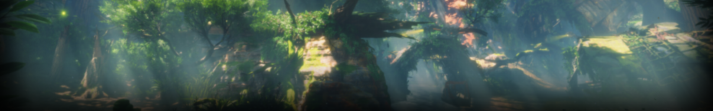

# Zelda-Souls

Zelda Souls is a Python game developed using the Pygame library. It is a 2D action-adventure game inspired by the Legend of Zelda series with Dark Souls like RPG elements.


## Introduction

Zelda Souls is a project created for educational purposes. The game features a character navigating through various levels, battling enemies, and solving puzzles in a top-down perspective.

## Features

- Top-down 2D gameplay
- Character movement and interaction
- Enemy AI with attack patterns
- Health and damage system
- Sound effects and background music
- Customizable levels and graphics

## Installation

1. Clone the repository to your local machine:

```bash
git clone https://github.com/arindal1/Zelda-Souls.git
```

2. Navigate to the project directory:

```bash
cd Zelda-Souls
```

3. Install the required dependencies using pip:

```bash
pip install -r requirements.txt
```

## Usage

To run the game, execute the following command:

```bash
python main.py
```

Use the arrow keys to move the character and interact with objects. Press 'M' to toggle the in-game menu.

## Credits

- Graphics: [Pixel-Boy & AAA](https://pixel-boy.itch.io/ninja-adventure-asset-pack).
- Inspired by: [Legend of Zelda](https://en.wikipedia.org/wiki/The_Legend_of_Zelda) & [Dark Souls](https://en.wikipedia.org/wiki/Dark_Souls).

## License

This project is licensed under the [MIT License](LICENSE).


